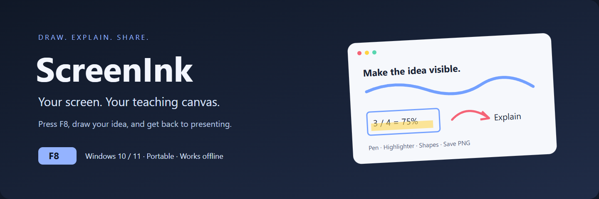
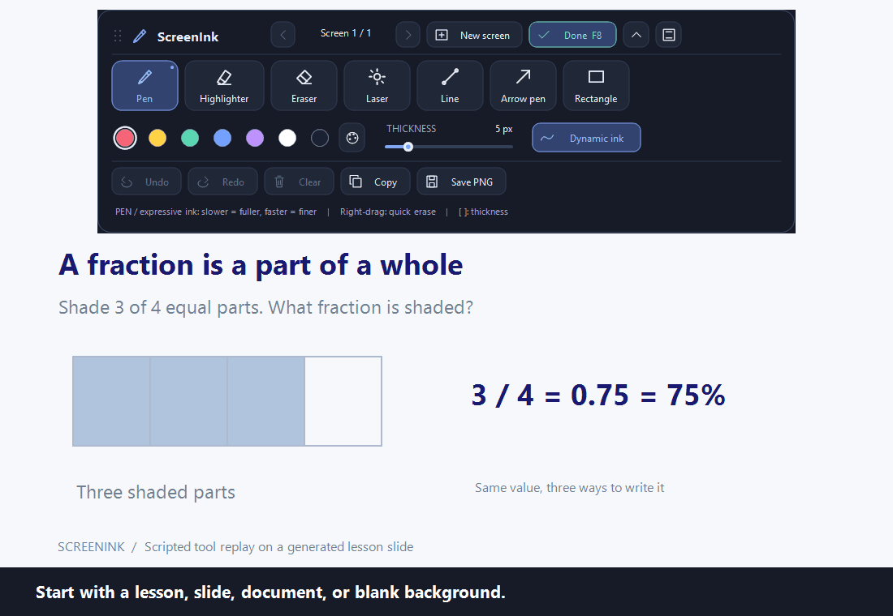
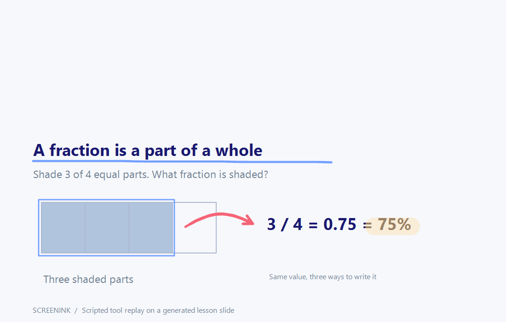

  
  
  

  
  
  
  

# ScreenInk

**Press F8. Draw on your screen. Make your explanation easier to follow.**

ScreenInk is a portable Windows annotation app for teachers, tutors, presenters, and anyone who wants to explain an idea visually. Start it once, then press **F8** or choose **New screen** from its tray menu to turn what you are looking at into a drawing canvas. Write over a slide, highlight part of a document, sketch a diagram, or point to a detail. Press **F8**, **Esc**, or **Done** when you want to continue presenting.

It freezes the current screen while you draw. Your slide, browser page, or video stays still underneath your annotations, so the content does not move while you explain it. Closing the drawing overlay returns you to the live desktop. Earlier drawings stay available until you exit the app.

**No installer, account, subscription, or internet connection is needed to run ScreenInk.** The portable launcher uses Windows PowerShell 5.1 and the .NET Framework / Windows Forms components supplied with Windows. You do not need Python, Node.js, Visual Studio, or a separate drawing app.

## See it in action

The demo explains why **3/4 = 0.75 = 75%**: frame the shaded parts, connect them to the answer, highlight the percentage, and correct a stray mark. It is a **scripted replay through the real ScreenInk canvas mouse handlers and toolbar**, using a generated teaching slide. It is not a recording of a person's desktop. Captions explain each step; the loop lasts about 26 seconds. The F8 desktop capture, clipboard, and system save dialog are described below rather than shown in this replay.

Here is the PNG that the same canvas exports. It contains the lesson and annotations without the toolbar:

## Who is it for?

- **Teachers and tutors:** work through a problem, mark important words, or explain a diagram during an online lesson.
- **Presenters and trainers:** highlight a slide, connect ideas with arrows, and keep your audience's attention on the relevant detail.
- **Students and collaborators:** sketch an explanation over a document, then save or copy the annotated image.
- **Anyone needing a simple whiteboard:** open the included offline whiteboard page, make it full screen, and start drawing.

## Start in under a minute

1. [Download the latest release](https://github.com/FarzamFattahi/ScreenInk/releases/latest). Choose **ScreenInk-v1.0.0-Windows-Portable.zip** under **Assets**.
2. Right-click the downloaded ZIP and choose **Extract All**. Keep all extracted files together.
3. Open the extracted **ScreenInk Portable** folder and double-click **Start ScreenInk.bat**.
4. Open the slide, lesson, image, or document you want to explain, then press **F8**.
5. Select a drawing tool, choose a color, and draw. **Save PNG** keeps the result; **Done** returns to your presentation.

ScreenInk initially runs in the background. Look for its icon in the system tray near the Windows clock; it may be inside the hidden-icons menu. You can double-click that icon to toggle drawing, or right-click it and choose **New screen (F8)**. Right-click it and choose **Exit** to quit completely.

For a blank whiteboard, open **Whiteboard.html** in your browser, press **F11**, click **Hide instructions and use whiteboard**, then press **F8**. This page works offline. Prepare every connected monitor before capturing a screen, because ScreenInk captures them all.

## Input and requirements

- Windows 10 or Windows 11 desktop with Windows PowerShell 5.1 and the standard .NET Framework / Windows Forms components available.
- A mouse or touchpad: hold the left button and move to draw. On a touchpad, use click-and-drag; the gesture depends on your touchpad settings.
- A touchscreen or stylus can draw when Windows delivers its input as left-button mouse events. ScreenInk currently handles mouse events; dedicated pen-pressure, tilt, palm rejection, and multi-touch features are not implemented. Hardware-specific touch and stylus behavior has not been verified for this release.
- Normal desktop access. Some school or work computers restrict PowerShell or dynamically compiled code; your IT administrator can advise whether it is allowed.

## What you can do

| Tool or feature | Use it to |
| --- | --- |
| Pen | Write, underline, and sketch with smooth freehand ink |
| Highlighter | Add translucent emphasis while keeping text visible |
| Eraser | Remove a whole stroke, with a preview before deletion |
| Laser | Point with a glowing, fading trail without adding permanent ink |
| Line | Draw straight lines; hold Shift to snap to 45-degree increments |
| Arrow pen | Draw a freehand curve with an arrowhead added when you release |
| Rectangle | Frame a region; hold Shift to make a square |
| Undo / redo | Correct drawings and restore erased strokes |
| Compact dock | Keep tools available while taking up less screen space |
| Previous / next | Revisit earlier annotated screens during the session |
| Save PNG / Copy | Export the screen and ink without toolbars or temporary pointers |

## Portable copy

Carry the **ScreenInk Portable** folder, or **ScreenInk Portable.zip**, to another Windows 10/11 PC. Extract the ZIP completely before use, then double-click **Start ScreenInk.bat** inside the extracted folder. Keep all included files together. No internet connection or installation is needed; managed PCs may restrict PowerShell. Exit from the tray menu before removing the USB drive. Drawings are session-only, so save important annotations as PNG before exiting.

## Use

- Press **F8** anywhere to open the drawing overlay.
- Draw with the left mouse button.
- Choose **Pen**, **Highlighter**, **Eraser**, **Laser**, **Line**, **Arrow**, or **Rectangle**. Rounded icon buttons animate their hover, press, and selection states. The active tool has an accent border, indicator dot, and a description below the toolbar.
- Pen strokes are stabilized and smoothed as you draw, with rounded ends. **Dynamic ink** adds a stronger expressive effect: slow movements produce fuller strokes and fast movements produce fine strokes, with smooth transitions between widths. Click it to turn it off for constant thickness. Highlighter strokes keep a steady width and consistent translucency.
- Move the eraser over ink to preview the whole stroke in pink. Click or drag to delete it; the deleted ink briefly fades away. Erasing removes the entire connected stroke drawn in one mouse-down gesture. A drag can remove several strokes, and one undo restores them all.
- Pick a color and use the **Thickness** slider for precise line sizing from 1–24 pixels.
- Each tool remembers its own color and thickness during the session. The palette button opens a custom color picker.
- **Laser** creates a glowing pointer and a fading trail for pointing at content without adding permanent ink. Laser trails, cursor indicators, and erase previews never appear in exports.
- **Arrow pen** draws smooth freehand curves like a pen. When you release the mouse, an arrowhead appears at the end, following the curve's final direction. The curve and tip undo and erase together as one stroke.
- Drag **Line** or **Rectangle** to make a clean diagram. Hold **Shift** for 45-degree line snapping or a square.
- Hold the **right mouse button** to erase temporarily, then release it to keep using your selected tool.
- Drag the grip or **ScreenInk** title to move the toolbar. Drag close to a screen edge to snap it there, or use the **Dock** icon to choose **Top**, **Bottom**, **Left**, or **Right**. The chosen edge is remembered during the session.
- The chevron button (or **Ctrl+Tab**) switches between the full toolbar and a **quick tool dock**. The compact dock keeps all seven tools, undo/redo, docking, expand, and Done directly accessible. It is horizontal on the top/bottom and vertical on either side.
- In the compact dock, click a different tool to select it. **Click the selected tool again** to open its options beside the dock; click it once more, use the panel's close button, or click outside to dismiss the options.
- Tool options include pen/arrow color, thickness, and dynamic ink; highlighter color, thickness, and opacity; eraser target size; laser color and trail fade time; and line/rectangle color and thickness. Options update immediately, and existing strokes retain their original appearance.
- Use **Undo** (`Ctrl+Z`), **Redo** (`Ctrl+Y` or `Ctrl+Shift+Z`), **Clear**, or **Save PNG**. Undo has no fixed step limit and works while the toolbar or slider has focus.
- **Copy** (`Ctrl+C`) puts the annotated image on your clipboard, ready to paste into a document or chat. **Save PNG** also has the shortcut `Ctrl+S`.
- Press **F8** again, `Esc`, or **Done** to close the overlay and return to the live desktop.

ScreenInk stays in the background after the overlay closes. Right-click its system-tray icon and choose **Exit** to quit completely. You can also start drawing from the tray menu.

## Revisit earlier drawings

Every F8 opening captures a new screen. Your earlier screens, annotations, and complete undo/redo history remain available while ScreenInk is running.

- Use **Previous** / **Next**, or `Alt+Left` / `Alt+Right`, to browse and edit earlier screens.
- **New screen** captures the current live desktop as another page.
- Choose **Resume previous drawing** from the tray menu to reopen the last viewed page directly without making a new capture.
- Each screen has its own undo/redo history. Closing an overlay preserves it; exiting ScreenInk ends the session and releases it.
- Use **Save PNG** to keep a permanent image. PNG exports contain the screenshot and ink, without the toolbar, eraser preview, or deletion animation.

## Notes

- Annotation mode intentionally uses a frozen snapshot. This keeps videos, slides, and web pages from moving while you explain them.
- All connected monitors are captured. The toolbar appears near the top of the primary monitor.
- Saved images are PNG files and include both the captured screen and annotations.

## Presenting online and keeping captures private

Start your meeting or recording and prepare the material you want to show. When you press F8, ScreenInk places a separate overlay over your desktop. **Share the screen/display containing that overlay** to include your annotations. Sharing only a browser or slide application's window may leave the overlay out of the call. Check the meeting preview before your lesson; capture behavior can vary between meeting apps.

ScreenInk works locally. The application has no account system, telemetry, cloud upload, or network requests. Screens and drawing histories remain in memory while it is running; it writes an annotated image when you save one and sends it to the Windows clipboard when you choose Copy. Clipboard contents may be handled by your own Windows clipboard-history or sync settings.

The normal F8 capture includes **all connected monitors and everything visible on them**. Before recording, exporting, or sharing, open a clean slide or the included whiteboard, close private windows, and check every display. PNG exports include the background as well as the ink. The repository's examples use only generated lesson content and contain no desktop icons, personal windows, or user files.

## Troubleshooting

| What you see | What to try |
| --- | --- |
| Nothing appears after launch | ScreenInk starts in the tray. Press F8 or find its icon in the hidden-icons menu. |
| F8 cannot be registered | Exit another ScreenInk instance or another app using the global F8 shortcut, then restart ScreenInk. |
| A file is missing | Extract the complete ZIP and keep the launcher, PowerShell script, and all four C# files together. |
| A school/work PC blocks startup | Ask your IT team whether Windows PowerShell and Add-Type are permitted. The launcher changes execution policy only for its own process; it does not change your system policy. |
| The overlay is missing from a meeting | Share the full screen/display and check the meeting preview. |
| The page stops moving while drawing | This is expected: drawing uses a frozen snapshot. Press F8 or Done to continue interacting with the original app. |
| Erasing removes more than expected | Eraser deletes an entire connected stroke from one mouse-down gesture. Undo restores it; use separate gestures for independently erasable marks. |
| Drawings disappear after Exit | History is session-only. Save PNG or Copy before exiting. Closing the overlay preserves drawings; exiting the background app does not. |
| Saving fails or the clipboard is busy | Choose another writable save folder, or try Copy again after the clipboard is available. |

## Current limits

ScreenInk is a Windows desktop tool. It does not offer macOS/Linux builds, a live click-through ink layer, editable project files, PDF export, built-in video recording, or session recovery after exiting. PNG images are flattened exports. Tool settings and docking preferences last for the current session. Earlier captured pages use memory, so save important work and restart after a long session with many large screen captures.

Multi-monitor coordinates and toolbar placement are covered by automated checks; real multi-monitor hardware, touchscreen/stylus devices, and individual meeting applications still need broader testing. Protected video or restricted desktop surfaces may not capture normally.

## Source, packaging, and contributions

The portable release contains readable PowerShell and C# source files, not an installer or a precompiled executable. `ScreenInk.ps1` loads Windows Forms, compiles the included C# classes locally with `Add-Type`, and manages captures, history, the tray menu, and F8. Everything needed by the launcher is inside the ZIP.

| File | Purpose |
| --- | --- |
| `Start ScreenInk.bat` | Launch with the Windows PowerShell executable and check required files |
| `ScreenInk.ps1` | Application lifecycle, capture, tray, exports, and page navigation |
| `ScreenInk.Core.cs` | Drawing canvas, stroke geometry, erasing, undo/redo, hotkey, and core checks |
| `ScreenInk.Studio.cs` | Full toolbar, brush preferences, styling, and toolbar checks |
| `ScreenInk.Dock.cs` | Compact dock, docking, tool options, and dock checks |
| `ScreenInk.ShortcutTests.cs` | Drawing-to-eraser shortcut regression checks |
| `Whiteboard.html` | Optional offline blank background |
| `tools/` | Development-only packaging and reproducible demo tools |

To package a release locally, run `powershell.exe -NoProfile -ExecutionPolicy Bypass -File .\tools\Package.ps1`. It creates a portable ZIP and a SHA-256 checksum in `dist/`. Extract the ZIP fully before running it. The published release includes `SHA256SUMS.txt` for checking download integrity with `Get-FileHash`.

To rebuild the example, run `powershell.exe -STA -NoProfile -ExecutionPolicy Bypass -File .\tools\Record-Demo.ps1`, then `python tools/Encode-Demo.py demo-replay-frames docs/assets/demo.gif` with Pillow installed. These developer tools are optional and are not needed to use ScreenInk. The replay never captures the desktop; it also checks erasing and undo/redo before exporting the lesson.

Bug reports and improvements are welcome through [GitHub Issues](https://github.com/FarzamFattahi/ScreenInk/issues). Include the Windows version, input device, exact steps, and expected/actual behavior. Check screenshots for private content before attaching them. See [CONTRIBUTING.md](CONTRIBUTING.md) for verification and contribution guidance.

## Quick shortcuts

| Key | Action |
| --- | --- |
| F8 / Esc | Return to the live desktop (F8 also opens a new screen) |
| P / H / E / L | Pen / Highlighter / Eraser / Laser |
| I / A / R | Line / Arrow / Rectangle |
| [ / ] | Decrease / increase thickness |
| Ctrl+Z / Ctrl+Y | Undo / redo |
| Ctrl+C / Ctrl+S | Copy image / save PNG |
| Ctrl+Tab | Quick tool dock / full toolbar |
| Alt+Left / Alt+Right | Previous / next drawing |

## Verification

Run `powershell.exe -STA -NoProfile -ExecutionPolicy Bypass -File .\ScreenInk.ps1 -ShortcutTest` for the draw-to-eraser regression: long-stroke hit-test responsiveness, repeated Pen → E → erase → undo in full/compact modes, and switching while the mouse is still held. Eraser geometry is cached to avoid expensive GDI+ outline widening on mouse moves. This check also runs in the full self-test below.

Run `powershell.exe -STA -NoProfile -ExecutionPolicy Bypass -File .\ScreenInk.ps1 -SelfTest` to check ink consistency, stronger dynamic widths, whole-stroke and quick erasing, 125-step undo/redo, keyboard shortcuts, shapes and snapping, laser isolation, per-tool settings, animated selection, compact layouts, and page retention. This does not start the background app.

Add `-TestArtifactsPath .\verification` to render synthetic ink samples and each toolbar state for visual inspection. These images contain generated test content, not captured desktop screenshots.

The same self-test runs on GitHub Actions on a Windows runner. A passing run checks canvas and toolbar behavior; it does not certify a particular touchscreen, stylus, conferencing app, or Windows security policy.

## License

ScreenInk is available under the [MIT License](LICENSE). You may use, modify, and share it, including for teaching and commercial presentations.
